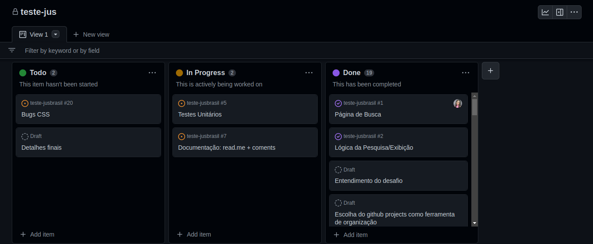

 
  
  # Jusbrasil: teste técnico 
  
  

  
  
  
  
  
   
   
  
   
  
  **Status do Projeto:** _Concluido_ 
  

## Índice

* [1. Resumo do projeto](#1-resumo-do-projeto)

* [2. Considerações Técnicas](#2-considerações-técnicas)  
  * [2.1 Planejamento](#21-planejamento)
  * [2.2 Ferramentas utilizadas](#22-ferramentas-utilizadas)  
  * [2.3 Boilerplate](#23-boilerplate)
  
  
***

## 1. Resumo do projeto

  Desafio técnico proposto pelo Jusbrasil. O objetivo do projeto era construir duas páginas principais: uma página de consulta processual (busca) e
uma página de processos (exibição).

## 2. Considerações Técnicas

  O projeto foi desenvolvido utilizando HTML, CSS, JavaScript e React.JS. O armazenamento da dados foi feito em um arquivo JSON populado na pasta do projeto (db.json).
  
### 2.1 Planejamento
  Para o planejamento do projeto utilizou-se a ferramenta Projecs do GitHub e as Metologias Ágeis.

  

### 2.2 Ferramentas utilizadas  

  * Git;
  * GitHub;
  * GitHub Projects;
  * Visual Studio Code;
  
### 2.3 Boilerplate
